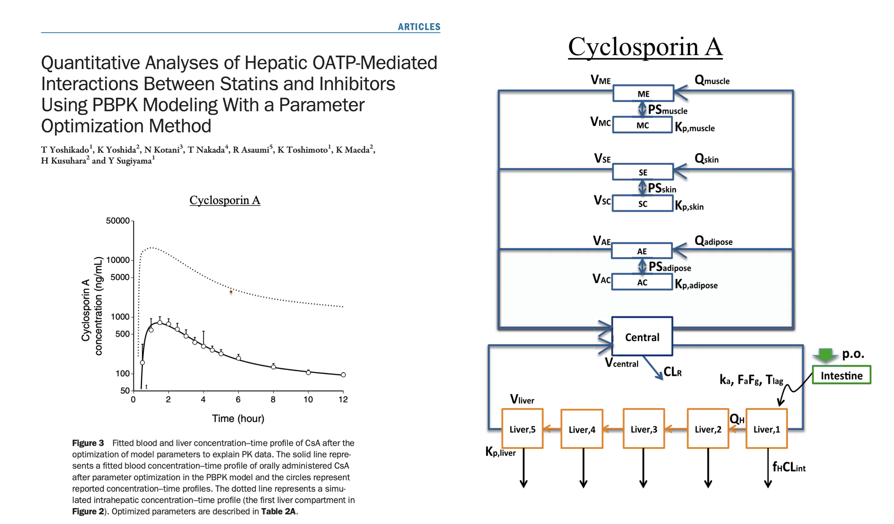
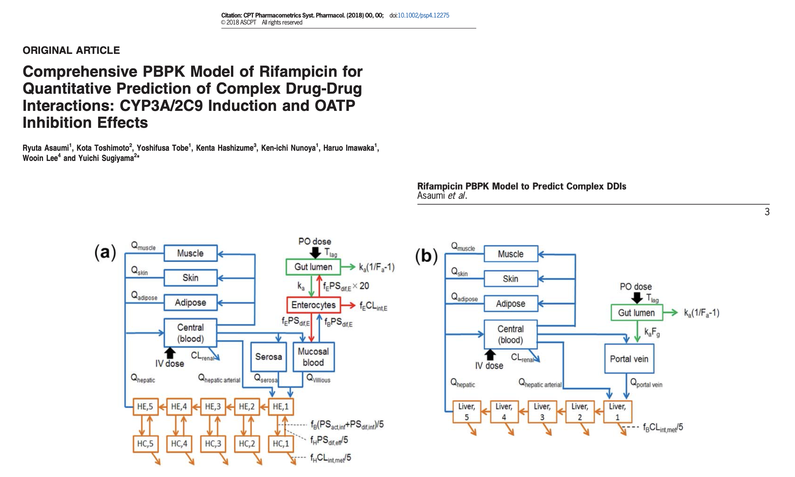
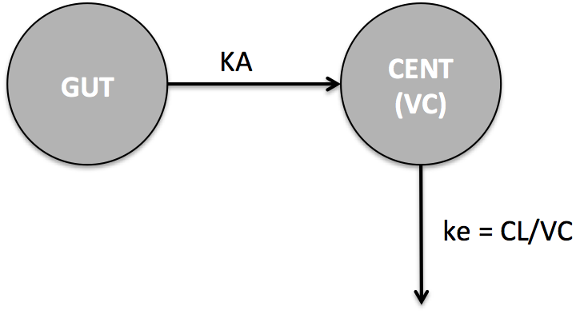

```{r, echo = FALSE, message = FALSE, warning = FALSE}
knitr::opts_chunk$set(message = FALSE)
options(mrgsolve.soloc = "build")
```


```{r, include = FALSE}
library(here)
source(here("day1/src/global.R"))
library(mrgsolve)
library(tidyverse)
library(knitr)
library(lattice)
library(patchwork)
tryit_file <- "workbook.Rmd"
```

```{r setup, echo = FALSE, message = FALSE}
mod <- mread_cache("pk1", modlib()) %>% 
  update(end = 192, delta = 0.2) %>% Req(CP)
data(exidata)
data <- filter(exidata, ID <= 10)
set.seed(1222)
```

# What can you do with mrgsolve?

```{r, echo = FALSE, fig.width = 6, fig.height = 5}
mod %>% ev(amt = 100) %>% mrgsim(end = 72) %>% plot()
```


```{r, echo = FALSE, fig.width = 6, fig.height = 5}
mod %>% ev(amt = 100, ii = 24, addl = 4) %>% mrgsim() %>% plot()
```


```{r, echo = FALSE, message=FALSE, fig.width = 6, fig.height = 5}
mod <- mread_cache("popex", modlib()) %>% Req(DV)
data <- expand.ev(amt = 300, ii = 24, addl = 4, ID = seq(20))
mod %>% data_set(data) %>% mrgsim() %>% plot()
```


```{r, echo = FALSE, fig.width = 6, fig.height = 5}
hmod <- mrgsolve:::house() %>% Req(DV,RESP) %>% update(end = 244)
hdat <- mutate(data, time = 24)
mrgsim(hmod, data = hdat, omega = dmat(0.1,0.1,0.1,0.1)) %>% plot()
```


```{r, echo = FALSE, fig.width = 6, fig.height = 5}
idata <- tibble(VC = c(20,60,180))
hmod %>% mrgsim(idata = idata,  end = 24*28, delta = 0.1,
                events = ev(amt = 100, ii = 24, addl = 28)) %>%
  plot(DV~.)
```


```{r, echo = FALSE, message = FALSE, warning=FALSE, fig.width = 6, fig.height = 5}
mod <- mread_cache("conway", .day1("model"))
e <- ev(amt = 1, evid = 8, time = 180) + ev(amt = 0, evid = 8, time = 2.5*365)
idata <- tibble(L_0 = c(1,3,5,7,10))
out <- mrgsim(mod, events = e, idata = idata, end = 6*365, delta = 1)
out@data <- mutate(out@data, time = time - 180)
plot(out, L+logV~(time/365), xlab = "Time (year)")
```


# About `mrgsolve` 

- `R` package for simulation from ODE-based models
    - Free, OpenSource, GitHub, CRAN
- Language
    - Models written in `C++` inside model specification format
    - General purpose solver: `ODEPACK` / `DLSODA` (`FORTRAN`)
        - Automatically detect and switch between non-stiff (Adams) and stiff (BDF)
          methods for solving the differential equations
    - Simulation workflow in `R`
- Hierarchical (population) simulation
    - `ID`, $\eta$, $\varepsilon$
- Integrated PK functionaility
    - Bolus, infusion, `F`, `ALAG`, `SS` etc, handled under the hood
    - 1- and 2-cmt PK models in closed-form
- Extensible using `R`, `C++`, `Rcpp`, `boost`, `RcppArmadillo`
- `R` is it's natural habitat

# `mrgsolve` started as `QSP` modeling tool
- Motivation: large bone/mineral homeostatsis model (CaBone)
- History using
    - Berkeley Madonna
    - WinBUGS
    - NONMEM (attempted)
- 2010: write `R` front end to `deSolve`
- 2012: write `C++` interface to `DLSODA`
- Develop dosing / event capability
- More recently, expose functionality provided by
    - `Rcpp` - vectors, matrices, functions, environments, random numbers 
    - `boost` - numerical tools in `C++`
    - users' own `C++` code (functions, data structures, classes)
- Translator from `SBML` to `mrgsolve` using `R` bindings to `libSBML`   


# Orientation

- https://CRAN.R-project.org/package=mrgsolve

- GitHub site: https://github.com/metrumresearchgroup/mrgsolve

- Discussion: https://github.com/metrumresearchgroup/mrgsolve/discussions

- Issues: https://github.com/metrumresearchgroup/mrgsolve/issues

- mrgsolve website: https://mrgsolve.org

- User Guide: https://mrgsolve.org/user_guide

- Blog: https://mrgsolve.org/blog

- Vignettes: https://mrgsolve.org/vignettes

# R for Data Science

https://r4ds.had.co.nz/


# What we will cover today

1. Three basic workflows
1. Loading the model into R
1. Event objects
1. Data sets
1. Model specification - code together
1. Whatever you ask about


---

```{r setup-1, echo = FALSE, message = FALSE}
mod <- mread_cache("pk1", modlib()) %>% 
  update(end = 192, delta = 0.2) %>% 
  Req(CP)
data(exidata)
data <- filter(exidata, ID <=10)
set.seed(1222)
```

# A basic simulation with mrgsolve
```{r, fig.width = 6, fig.height = 5}
mod %>% ev(amt = 100, ii = 24, addl = 3) %>% mrgsim() %>% plot()
```


# A basic simulation with mrgsolve

```{r, eval = FALSE, fig.width = 6, fig.height = 5}
mod %>% ev(amt = 100, ii = 24, addl = 3) %>% mrgsim() %>% plot()
```

- <red>mod</red>: the model object
    - Ok ... where did `that` come from?
- <blu>ev(amt = 100, ...)</blu> : the intervention
    - An `event` in this example
- <grn>mrgsim()</grn>: actually do the simulation
- <orng>plot()</orng>: do something with the simulation
    - `plot`, `mutate`, `as_tibble` etc ... 


> - <red>model</red> `%>%` <blu>intervention</blu> `%>%` <grn>Go!</grn> `%>%` <orng>take-a-look</orng> 

# What's coming ...

> - `model %>% intervention %>%` <alrt>options</alrt> `%>% Go! %>% ...`

> - `model %>% intervention %>%` <orng>population</orng> `%>% Go! %>% ...`

> - `model %>%` <purp>data-set</purp> `%>% Go! %>% ...`

> - where <purp>data-set</purp> = `intervention + population`

> - For now, let's get this part down 

> - <red>model</red> `%>%` <blu>intervention</blu> `%>%` <grn>Go!</grn> `%>%` <orng>take-a-look<orng> 


# Why do we use `%>%` ?

What happens first in this operation?

```{r, eval = FALSE}
mean(sqrt(seq(4)))
```

# Pipelines

```{r, eval = FALSE}
mean(sqrt(seq(4)))
```

```{r, eval = FALSE}
4  %>% seq() %>% sqrt() %>% mean()
```

Better.

```{r, eval = FALSE}
4  %>% 
  seq(.) %>% 
  sqrt(.) %>% 
  mean(., na.rm = TRUE)
```

```{r,eval = FALSE}
mod %>% some_intervention() %>% simulate() %>% post_process()
```


# The model object

<red>mod</red><blk>el</blk> `%>% ... `

> - I (almost) always call the model object <red>mod</red> in the documention / examples

> - All the information about the model we need to know to run the simulation

> - <grn>Distinct</grn> from the intervention, the population, the summary

> - But the model <orng>does</orng> know  about output time, random effects


# Take a look: overview

```{r, comment = ""}
mod
```

# Take a look: parameters (<red>really important</red>)
```{r, comment = ""}
param(mod)
```

> - Parameters get a name
> - Names and number of parameters gets fixed at compile time
> - All parameters have a value
> - Value can be modified after compile time

# Take a look: compartments
```{r, comment = ""}
init(mod)
```

> - Every compartment gets a name
> - Every compartment gets an initial condition


```{r echo = FALSE, message = FALSE}
mod <- mread_cache("pk1", modlib()) %>% 
  update(end = 192, delta = 0.2) %>% Req(CP)
data(exidata)
data <- filter(exidata, ID <=10)
set.seed(1222)
```

# Where did <red>mod</red> come from?

```{r, eval = FALSE}
mod <- mread("simple", "model")
```


```{r, eval = FALSE}
mod <- mread("<model-name>", "<project-directory>")
```

- By default mrgsolve looks for the code in the file
    - <grn>model-name.cpp</grn> in
    - <blu>project-directory</blu>

- <red>mread demo</red>

```{r, echo = FALSE}
Sys.sleep(2)
```


# Read in a model object with caching {.drop}

First time to read
```{r, include = FALSE, message = FALSE}
mod <- mread("simple", here("day1/model"), preclean = TRUE, compile = FALSE)
```


```{r, message = TRUE}
mod <- mread_cache("simple", here("day1/model"))
```

Next time to read

```{r, message = TRUE}
mod <- mread_cache("simple", here("day1/model"))
```

# Model build directory (`soloc`)

It can be helpful to set

```{r, eval=FALSE}
options(mrgsolve.soloc = "my_build_directory")
```

Equivalent to 

```{r,eval=FALSE}
mod <- mread("simple", here("day1/model"), soloc = "my_build_directory")
```

# Internal model library

```{r, eval = FALSE}
mod <- mread("<first-argument>", "<second-argument>")
```

# Internal model library

```{r, eval = FALSE}
mod <- mread("<first-argument>", "<second-argument>")
```

```{r, eval = FALSE}
mod <- mread("<first-argument>", modlib())
```

```{r}
modlib()
```


# Internal model library
```{r}
mod <- mread("effect", modlib())
```

```{r}
mod
```


# Try this now

Open R script in Rstudio then ...

```{r, eval = FALSE}
library(mrgsolve)
```


```{r,eval=FALSE}
mod <- mread("pbpk", modlib())
```


```{r}
mod <- modlib("pbpk")
```

# <red>Your turn</red>

- File name: <grn>day1/exercises/warm_up.R</grn>

- Section name: <blu>Warm Up</blu>


```{r  echo = FALSE, message = FALSE}
mod <- mread_cache("pk1", modlib()) %>% 
  update(end = 192, delta = 0.2) %>% Req(CP)
data(exidata)
data <- filter(exidata, ID <=10)
set.seed(1222)
```

# Event objects

- `model %>%` <red>intervention</red> `%>% Go! %>% take-a-look`

- Event object  = quick / easy way to implement dose or other intervention


```{r}
e <- ev(amt = 100) 

e
```

> - Defaults: `time`, `evid`, `cmt`

# Three ways to invoke

<blk>Inline</blk>

```{r, eval = FALSE}
mod %>% ev(amt = 100) %>% mrgsim()
```

<blk>Object via pipeline</blk>

```{r, eval = FALSE}
e <- ev(amt = 100)

mod %>% ev(e) %>% mrgsim()
```

<blk>As argument</blk>

```{r, eval = FALSE}
mod %>% mrgsim(events = e)
```


# What to include in `ev(...)`

- <grn>time</grn> event time
- <grn>cmt</grn> Event compartment
- <grn>amt</grn> Dose amount
- <grn>ii</grn> Inter-dose interval
- <grn>addl</grn> Additional doses to administer
- <grn>rate</grn> Infusion rate
- <grn>ss</grn> Set to 1 to advance to steady state
- <grn>evid</grn> Event id
- <grn>ID</grn> Subject ID (use multiple ids - ID=1:10)

# Interventions and corresponding `evid`

-  <grn>Bolus</grn> dosing (`evid` 1, with `rate`==0)
-  Zero order <grn>infusion</grn> (`evid` 1, with `rate` > 0)
-  <grn>Other</grn> type event (`evid` 2)
    -  This also forces solver reset
-  Compartment <grn>reset</grn> (`evid` 3)
-  <grn>Reset</grn> and dose (`evid` 4)
-  <grn>Replace</grn> the amount in a specific compartment (`evid` 8)

# <red> Your Turn</red>

- File name: <grn>day1/exercises/pbpk-csa.R</grn>


<center>
</img>
</center>


# Create complex events - 1

What's going to happen?

```{r, eval = FALSE}
e1 <- ev(amt = 200) 

e2 <- ev(amt = 100, time = 24, ii = 24, addl = 4)

c(e1, e2)
```

# Create complex events - 1

What's going to happen?

```{r, echo = FALSE}
e1 <- ev(amt = 200) 
e2 <- ev(amt = 100, time = 24, ii = 24, addl = 4)
e <- c(e1,e2)
mod %>% 
  ev(e) %>% 
  mrgsim(end = 120) %>% plot(CP~.)
```


# Create complex events - 1

Combine two events

```{r}
e1 <- ev(amt = 200) 

e2 <- ev(amt = 100, time = 24, ii = 24, addl = 4)

c(e1, e2)
```

# Create complex events - 2

What's going to happen?

```{r, eval = FALSE}
e1 <- ev(amt = 200, ii = 12, addl = 2) 

e2 <- ev(amt = 100, ii = 24, addl = 4)

seq(e1, e2)
```

# Create complex events - 2

What's going to happen?

```{r, echo = FALSE}
e1 <- ev(amt = 200, ii = 12, addl = 2) 
e2 <- ev(amt = 100, ii = 24, addl = 4)
e <- seq(e1, e2)
mrgsim(mod, events = e, end = 180) %>% plot(CP ~ .)
```


# Create complex events - 2

Put two events in a sequence

```{r}
e1 <- ev(amt = 200, ii = 12, addl = 2) 

e2 <- ev(amt = 100, ii = 24, addl = 4)

seq(e1, e2)
```


# Create complex events - 3

What is going to happen?

```{r, eval = FALSE}
e1 <- ev(amt = 200) 

e2 <- ev(amt = 100, ii = 24, addl = 4)

seq(e1, wait = 36, e2)
```

# Create complex events - 3

What is going to happen?

```{r, echo = FALSE}
e1 <- ev(amt = 200) 
e2 <- ev(amt = 100, ii = 24, addl = 4)
e <- seq(e1, wait = 36, e2)
mrgsim(mod, events = e, end = 180) %>% plot(CP ~ .)
```

# Create complex events - 3

Wait before starting the next part of the regimen

```{r}
e1 <- ev(amt = 200) 

e2 <- ev(amt = 100, ii = 24, addl = 4)

seq(e1, wait = 36, e2)
```


# <red>Your Turn</red>

- File Name: `day1/examples/pbpk-rifampin-ddi.R`


<center>
</img>
</center>

# Event objects are just data frames

```{r}
as.data.frame(e1)
```

- We will use a <blk>data_set</blk> later on for populations

- Event objects are convenient
  - Constructor
  - Operations
  
  
```{r  echo = FALSE, message = FALSE}
mod <- mread_cache("pk1", modlib()) %>% 
  update(end = 192, delta = 0.2) %>% Req(CP)
data(exidata)
data <- filter(exidata, ID <=10)
set.seed(1222)
```

# Simulate

```{r, echo = FALSE, message = FALSE}
mod <- mread_cache("effect", modlib())
```


<hr>

`model %>% intervention %>%` <grn>Go!</grn>

<hr>


```{r}
e <- ev(amt = 100)

mod %>% ev(e) %>% mrgsim()
```


```{r, eval = FALSE}
mrgsim(mod, events = e)
```

# What would you like to "fix" in this plot?

```{r,echo= FALSE}
mod <- update(mod, end = 18, delta = 6)
```

```{r}
mod %>% ev(amt = 100) %>% mrgsim() %>% plot(CP~time)
```

# Simulation end time
```{r}
mod %>% ev(amt = 100) %>% mrgsim(end = 48) %>% plot(CP~time)
```

# Simulation time step
```{r}
mod %>% ev(amt = 100) %>% mrgsim(end = 48, delta = 0.1) %>% plot(CP~time)
```


# Simulation time grid

-  To form a sequence of times
    - <grn>start</grn> usually `0`
    - <grn>end</grn> time of last observation
    - <grn>delta</grn> <blk>output</blk> time step
-  Additional times to simulate
    - <purp>add</purp> ad-hoc numeric vector
    
```{r}
stime(mod)
```

# We're stil working on this setup

<hr>

<red>model</red> `%>%` <blu>intervention</blu> `%>%` <grn>Go!</grn> `%>%` <orng>take-a-look</orng> 

<hr>

<red>model</red>:

- Load a model with `mread` or `mread_cache`
- Use the internal library with `mread("<model-name>", modlib())`
- Check model parameters with `param(mod)`
- Check model initial conditions with `init(mod)`
- View model code with `see(mod)`

<blu>intervention</blu>:

- `ev(...`): `amt`, `cmt`, `time`, `ii`, `addl`, `rate`
- Different ways to combine event objects


# Working with simulated output

<hr>

`model %>% intervention %>% Go! %>%` <orng>take-a-look</orng> 

<hr>

# Plot

```{r}
mod <- mread_cache("effect", modlib())

mod %>% ev(amt = 100) %>% mrgsim() %>% plot()
```

# Plot

```{r}
mod %>% ev(amt = 100) %>% mrgsim() %>% 
  plot(CP + EFFECT~., col = "firebrick")
```

# Pipeline to dplyr functions

```{r}
mod %>% mrgsim() %>% mutate(arm = 1)
```

# Controlling output - <grn>request</grn>

```{r}
mod %>% mrgsim() %>% head(n = 2)
```

```{r}
mod %>% Req(CP) %>% mrgsim() %>% head(n = 2)
```


# Controlling output - <grn>obsonly</grn>
```{r}
mod %>% ev(amt=1) %>% mrgsim() %>% head(n = 2)
```

```{r}
mod %>% ev(amt=1) %>% obsonly() %>% mrgsim() %>% head(n = 2)
```


```{r  echo = FALSE, message = FALSE}
mod <- mread_cache("pk1", modlib()) %>% 
  update(end = 192, delta = 0.2) %>% Req(CP)
data(exidata)
data <- filter(exidata, ID <=10)
set.seed(1222)
```

# Updating the model object


---

# Update

On the fly

```{r, eval = FALSE}
mod %>% update(end = 72) %>% mrgsim()
```

Persistent 

```{r, eval = FALSE}
mod <- update(mod, end = 72)
```

mrgsim will call `update` for you (on the fly)
```{r, eval = FALSE}
mod %>% mrgsim(end = 72)
```


# What else can I update?
* Time
    - `start`, `end`, `delta`, `add`
* Parameters and compartment initial values
* Solver settings
    * `atol`, `rtol`
    * `hmax`, `maxsteps`, `mxhnil`, `ixpr`
* `$OMEGA`, `$SIGMA`
* `tscale` (rescale the output time)
* `digits`

```{r, eval = FALSE}
mod %>% update(rtol = 1E-12) %>% ...
```

```{r, eval = FALSE}
mod %>% mrgsim(rtol = 1E-12) %>% ...
```

# Updating parameters

- Demo

```{r,eval = FALSE}
mod <- param(mod, CL = 1.5)
```


```{r echo = FALSE, message = FALSE}
mod <- mread_cache("pk1", modlib()) %>%
  update(end = 192, delta = 0.2) %>% Req(CP)
data(exidata)
data <- filter(exidata, ID <=10)
set.seed(1222)
```

```{r, echo = FALSE}
pop <- exidata
.out <-
  mod %>%
  ev(amt = 100, ii = 24, addl = 3) %>%
  idata_set(pop, ID <=10) %>%
  mrgsim()
```

# Add a population element to the simulation


- <red>model</red> `%>%` <blu>intervention</blu> `%>%` <grn>Go!</grn> `%>%`  <purp>take-a-look</purp>

> - `model %>% intervention %>%` <orng>population</orng> `%>% Go! %>% take-a-look`


# One population simulation with mrgsolve

<pre>
mod %>%
ev(amt = 100, ii = 24, addl = 3) %>%
<grn>idata_set(</grn><red>pop</red><grn>)</grn> %>%
mrgsim() %>% plot()
</pre>

```{r, echo = FALSE}
plot(.out)
```

# `idata_set` takes in individual-level data

- ID  - one per row
- Typically parameters in columns

```{r}
head(pop, n = 3)

length(unique(pop$ID))
```

- This tells mrgsolve to simulate `r length(unique(pop$ID))` units or individuals

# <red>pop</red> and <purp>mod</purp> are connected via <blu>parameters</blu>

```{r}
head(pop, n = 3)
```

```{r}
param(mod)
```

# What else can we do with `idata`?

Batches of simulations or sensitivity analyses

```{r}
idata <- expand.idata(CL = seq(0.5, 1.5, 0.25))
idata
```


# Note: this is the <grn>event</grn> `+` <blu>idata_set</blu> configuration


```{r}
mod %>%
  idata_set(idata) %>%
  ev(amt = 100, ii = 24, addl = 2) %>%
  mrgsim(end = 120) %>% plot(log(CP) ~ .)
```

# <red>Your turn</red>

- Description: sensitivity analysis in a PBPK model

- File name: <grn>exercises/sensi_pbpk.R</grn>


# `data_set` is the dosing equivalent to `idata_set`


```{r}
data <- expand.ev(amt = c(100, 300, 1000), ii = 24, addl = 3)

head(data)
```

# Note: this is `data_set` configuration

```{r}
mod %>%
  data_set(data) %>%
  mrgsim(end = 120) %>% plot(log(CP) ~ .)
```


# <grn>data_set</grn> can also carry parameters

```{r}
data <- expand.ev(
  amt = c(100,300,1000),
  ii = 24, addl = 3,
  CL = seq(0.5,1.5, 0.5)
)

head(data)
```

---
```{r}
data <- mutate(data, dose = amt)

mod %>%
  data_set(data) %>%
  mrgsim(carry.out = "dose", end = 120) %>%
  plot(log(CP)~time|factor(dose), group = ID, scales = "same")
```


# <blk>carry_out</blk> or <blk>carry.out</blk>

Copy from the input data to the output data

```{r}
mod %>% carry_out(dose) %>% data_set(data, dose==300) %>% mrgsim()
```


# <grn>data_set</grn> and <blu>ev</blu>

```{r}
head(data, n = 3)
```

```{r}
ev(amt = 100, ii = 24, addl = 3)
```

# We have now seen 3 simulation setups

> - `mod + ev = ?`
> - `mod + idata_set + ev = ?`
> - `mod + data_set = ?`

# Wait a minute ...
```{r}
head(data)
```

# Generating data sets

Recall that data sets are just plain old data.frames in R.  Feel free to 
code these up in any way that is convenient for you. 

In our experience, the following helper functions cover many (not every)
common needs for building the data sets. 


- `expand.ev`
- `ev_rep`
- `as_data_set`
- `ev_assign`


# `expand.ev`

Like `expand.grid`

```{r}
expand.ev(ID = 1:2, amt = c(100,200))
```


# `ev_rep`

```{r}
e <- ev(amt = 100, ii = 12, addl = 14)
ev_rep(e, ID = seq(5))
```

```{r, eval = FALSE}
e <- ev(amt = 100, ii = 12, addl = 14, ID = seq(5))
```


# `ev_rep`

```{r}
e <- seq(ev(amt = 100), wait = 36, ev(amt = 50, ii = 24, addl = 4))
e
```
```{r}
ev_rep(e, ID = seq(2))
```


# `as_data_set`

```{r}
data <- as_data_set(
  ev(amt = 100, ii = 12, addl = 19, ID = 1:2),
  ev(amt = 200, ii = 24, addl = 9,  ID = 1:3),
  ev(amt = 150, ii = 24, addl = 9,  ID = 1:4)
)
```
```{r, echo = FALSE}
head(data, n = 10)
```


# `ev_assign`

```{r}
pop <- expand.idata(GROUP = c(1,2), ID = 1:3)
head(pop)

e1 <- ev(amt = 100, ii = 24, addl = 9)
e2 <- mutate(e1, amt = 200)

data <- ev_assign(
  l = list(e1,e2), 
  idata = pop, 
  evgroup = "GROUP",
  join = TRUE
)

head(data)

```


# <red>Your turn</red>

- Description: simulate GCSF PK/PD profiles for weight-based
dosing

- File name: <grn>exercises/gcsf.R</grn>

# <red>Your turn</red>

- Description: Population PK of azithromycin

- File name: <grn>exercises/population_azithromycin.R</grn>


# <red>Your turn</red>

- Description: simulate PK profiles using empirical Bayes estimates 
from a meropenem model fit in NONMEM

- File name: <grn>exercises/sim_ebe.R</grn>


# Model specification


- Assign name=value pairs
  - like `CL = 1.25`
  - "parameters"
- Define compartment names and numbers
- Derived inputs that influence ODE system
  - like `ke = CL/V`
- Write ODEs
- Derived outputs 
  - Signal that we want this output 


# Let's make this model



> - What are the <grn>parameters</grn>?
> - What are the <blu>compartments</blu>?
> - What are the <purp>differential equations</purp>?


# Code up the model


# Block `$PARAM` [`R`] __declare and initialize model parameters__
```{c, eval=FALSE}
$PARAM CL = 1, VC = 20, KA=1.2
```


* Model "parameters" with `name = value` format
* Separate by `,` or `<newline>`
* Use any `name` except for words in `mrgsolve:::reserved()`
* Values are evaluated by `R` parser
* Multiple blocks allowed
* Use `name` anywhere in the model
* Updatable in `R` but read-only in the model specification file
    * Consider `$FIXED` if appropriate
* Most often, you will want to match names in `$PARAM` with
the names in your input data sets

# Block `$CMT` [`txt`]  __declare model compartments__

*  Specify `name` and `number` of compartments in the model
*  Use any name except for those listed in `mrgsolve:::reserved()`
*  See also  or `$INIT`

Example `$CMT`
```{c,eval=FALSE}
$CMT GUT CENT
```

Example `$INIT`
```{c,eval=FALSE}
$INIT GUT = 0, CENT = 10
```


# Block `$ODE` [`C++`] write differential equations

* Every compartment __needs__ an equation
* Form:`dxdt_CMT = ratein - rateout;`
* Use `CMT` for compartment amounts, parameters, or other variables
* This block of code gets called repeatedly so be wise

```{c, eval=FALSE}
$ODE
dxdt_GUT  = -KA*GUT;
dxdt_CENT =  KA*GUT - (CL/VC)*CENT;
```
# Derive `new variables` in your model

- Your model code is written in `C++`, which is a \blkb{typed} language
- When you want a new variable, you must say what it is
- `$MAIN`, `$ODE`, `$TABLE`, `$GLOBAL`

__To get a numeric variable__, use `double`

```{c, eval=FALSE}
double x = 5.4;
```

__Other types you might use__
```{c,eval=FALSE}
bool cured = false;
int i = 2;
```

If in doubt, use `double`; it's what you want most of the time.


# Block `$MAIN` [`C++`] __covariate model & initials__

For example
```{c, eval=FALSE}
$MAIN
double CL = TVCL*pow(WT/70,0.75);
double VC = TVVC*pow(0.86,SEX);
RESP_0 = KIN/KOUT;
```

In this example

  * `TVCL`, `KIN`, `KOUT`, `WT`, `SEX` were declared in `$PARAM`
  * There is a response compartment `RESP`


# `C++` expressions and functions

```{c, eval=FALSE}
if(a == 2) b = 2;
if(b <= 2) {
  c=3;
} else {
  c=4;
}
double d = pow(base,exponent);
double e = exp(3);
double f = fabs(-4);
double g = sqrt(5);
double h = log(6);
double i = log10(7);
double j = floor(4.2);
double k = ceil(4.2);
```


Lots of help on the web
http://en.cppreference.com/w/cpp/numeric/math/tgamma


# Preprocessor directives (`#define`)

```{c, eval=FALSE}
$GLOBAL
#define CP (CENT/VC)
#define g 9.8
$ODE
double INH = CP/(EC50+CP);
dxdt_RESP = KIN*(1-INH) - KOUT*RESP;
$CAPTURE CP
```


# Introduction to `POPULATION` simulation

- <dsb>Like NONMEM</dsb>, use `$OMEGA` and `$SIGMA` to define covariance matrices
for IIV and RUV, respectively


- <dsb>Like NONMEM</dsb>, use `ETA(n)` and `EPS(m)` for realized random effects
drawn from `$OMEGA` and `$SIGMA` respectively
    - BUT .... use labeled `ETA`s instead


- <dsb>Like NONMEM</dsb>, `mrgsolve` recognizes `ID` as a subject indicator for
simulating a new `ETA`


- <dsb>Like NONMEM</dsb>, `mrgsolve` allows you to write an error model
as a function of `EPS(m)` and any other calculated value
in your model


# Block `$OMEGA` and `$SIGMA` [`txt`]
* Specify random effect variance/covariance matrices
    * $\eta_i \sim N\left(0, \Omega \right)$
    * $\varepsilon_j \sim N \left(0, \Sigma \right)$

* NONMEM-style input - lower triangle
* Multiple `$OMEGA` and `$SIGMA` are allowed and each may be named
* How you enter these blocks defines a \ttg{signature} that `mrgsolve` will enforce later on
* Diagonal matrix (3x3 in this example)

```{c, eval=FALSE}
$OMEGA 0.1 0.2 0.3
```


# More `$OMEGA` and `$SIGMA`
* Options are `@` delimited & must be on different line from the matrix data
* Block matrix (2x2 in this example)

```{c, eval=FALSE}
$OMEGA @block
0.1 0.0947 0.2
```

* Block matrix with correlations (assumes `@block`)

```{c, eval=FALSE}
$OMEGA @cor
0.1 0.67 0.2
```


# Block `$OMEGA` and `$SIGMA`
* Multiple `$OMEGA` and `$SIGMA` are allowed; each may be named

```{c,eval=FALSE}
$OMEGA @name PK
0 0 0
$OMEGA @name PD
0 0
```


Users are encouraged to add labels

```{c, eval=FALSE}
$OMEGA @name PK @labels ECL EVC EKA
0 0 0
```


# About `@` macros

* Used to indicate options associated with different code blocks
* Most options are for `$OMEGA` and `$SIGMA`
* `@` should appear at the start of the line and the entire line is reserved
for options
* A line may contain multiple options: `@cor @name PK`

Two forms:

* Boolean: `@block` means `block=TRUE`
* Name/value: `@labels ECL EVC` means `labels=c("ECL", "EVC")`

# Closed-form PK models with `$PKMODEL`

- Set `ncmt` to 1 or 2
- Set `depot` to `TRUE` for extravascular dosing compartment
- Set `trans` to change the names of required parameters
- Use `$CMT` to declare 1 to 3 compartments as appropriate

```{c, eval=FALSE, osize="small"}
$PKMODEL cmt = "GUT CENT PERIPH", depot=TRUE
$PARAM CL = 1 , V2 = 30, Q = 8, V3 = 400, KA=1.2
```


# More `$PKMODEL`

```{c, eval=FALSE, osize="small"}
$PKMODEL ncmt=1, depot=TRUE
$CMT GUT CENT
$PARAM TVCL = 1 , TVV = 30, KA=1.2
$OMEGA @labels ECL EVC
1 1
$MAIN
double CL = TVCL*exp(ECL);
double V  = TVV *exp(EVC);
```


# Bioavailability, dosing lag time, and infusions

- To change the bioavability of doses administered to a compartment,
set `F_CMT` in `$MAIN`

- To add a lagtime for doses administered to a compartment, set `ALAG_CMT` in `$MAIN`

- To set the duration of infusion, set `D_CMT` in `$MAIN`
    - Also, use `rate = -2` in your data set or event object

- To set the infusion rate, set `R_CMT` in `$MAIN`
    - ALso, use `rate = -1` in your data set or event object


# Functions

- Two arguments: `x`, and `y`
- Pass arguments by name
- Return one thing `z`

```{r}
add <- function(x,y) {
  z <- x + y
  return(z)
}

add(x = 2, y = 3)
```


# Functions

- Arguments can be matched by position
- Calling `return()` is not strictly necessary

```{r}
add <- function(x, y) {
  x + y
}

add(2,3)
```


# Functions

- Arguments can have default values

```{r}
add <- function(x, y=3) {
  x + y
}

add(2)
```


# Sensitivity analysis

- Ad-hoc
  - Sequential: systematically vary the parameter value
  - Random: sample from a parametric or non-parametric distribution
- Local
    - small changes around a nominal value; one at a time
- Global
    - explore the whole parameter space; includes interactions


# Local sensitivity analysis 

We use the `lsa()` function from the mrgsim.sa package

```{r}
library(mrgsim.sa)
```


```{r, eval = FALSE}
?lsa
```

```{r, eval=FALSE}
sens <- lsa(model_object, parameter_names, output_variables)
```

# First, look at the result


```{r, echo = FALSE,fig.align="center", fig.height = 8, fig.width = 12}

mod <- modlib("irm1", end = 72, delta = 0.1)

sims <- mrgsim(mod, ev(amt = 100)) %>% as_tibble()
sens <- lsa(mod %>% ev(amt = 100), par = "CL,V2,Q,V3,KA", var = "CP", 
            eps = 1e-4)

p1 <- ggplot(sims, aes(time, CP)) + geom_line()
p2 <- lsa_plot(sens)
p1+p2
```


# A simulation scenario of interest

```{r}
mod <- modlib("irm1", end = 72, delta = 0.1)

mod %>%
  ev(amt = 100) %>% 
  mrgsim(end = 72, delta = 0.1) %>% 
  plot()
```


# lsa
```{r}
sens <- lsa(
  mod = ev(mod, amt = 100),
  par = "CL,V2,Q,KA", 
  var = "CP"
)

head(sens, n=3)
```

# The default plot method
```{r}
plot(sens)
```


# Global senstivity analysis

- All the parameters vary at once
- Investigate the whole parameter space
    - Or reasonable parameter space
- Evaluate both individual parameters as well as interactions between parameters
- Much greater computational burden


__We'll look at Sobol's method__


# Global senstivity analysis


- __Sobol Sensitivity Analysis: A Tool to Guide the Development and Evaluation of 
Systems Pharmacology Models.__
    - Zhang XY, Trame MN, Lesko LJ, Schmidt S.
    - CPT Pharmacometrics Syst Pharmacol. 2015 Feb;4(2):69-79. doi: 10.1002/psp4.6.
    - PMID: 27548289 
    - https://www.ncbi.nlm.nih.gov/pmc/articles/PMC5006244/

# Global senstivity analysis


- __Sobol Sensitivity Analysis: A Tool to Guide the Development and Evaluation of 
~~Systems Pharmacology~~ PBPK Models.__
    - Zhang XY, Trame MN, Lesko LJ, Schmidt S.
    - CPT Pharmacometrics Syst Pharmacol. 2015 Feb;4(2):69-79. doi: 10.1002/psp4.6.
    - PMID: 27548289 
    - https://www.ncbi.nlm.nih.gov/pmc/articles/PMC5006244/

# Sobol

- Variabillity in the output is decomposed, relating to variability in 
  different inputs or combinations of inputs
- We'll generate random samples of model parameters of interest and
  pass them off to `sensitivity::sobol2007`
- From our experience, put some reaonable limit parameter space
- Also, create a function that accepts a set of parameters and returns
  a simulated statistic of interest (like AUC)


