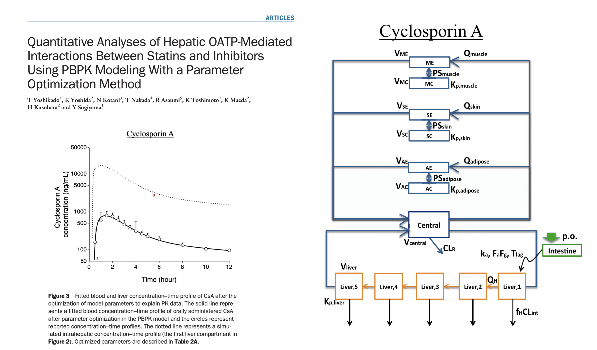

```{r, include = FALSE}
source(here::here("day1/src/global.R"))
library(mrgsolve)
library(dplyr)
library(knitr)
library(lattice)
tryit_file <- "workbook.Rmd"
```

```{r  echo = FALSE, message = FALSE}
mod <- mread_cache("pk1", modlib()) %>% 
  update(end = 192, delta = 0.2) %>% Req(CP)
data(exidata)
data <- filter(exidata, ID <=10)
set.seed(1222)
```


# Event objects

- `model %>%` <red>intervention</red> `%>% Go! %>% take-a-look`

- Event object  = quick / easy way to implement dose or other intervention


```{r}
e <- ev(amt = 100) 

e
```

> - Defaults: `time`, `evid`, `cmt`

# Three ways to invoke

<blk>Inline</blk>

```{r, eval = FALSE}
mod %>% ev(amt = 100) %>% mrgsim()
```

<blk>Object via pipeline</blk>

```{r, eval = FALSE}
e <- ev(amt = 100)

mod %>% ev(e) %>% mrgsim()
```

<blk>As argument</blk>

```{r, eval = FALSE}
mod %>% mrgsim(events = e)
```


# What to include in `ev(...)`

- <grn>time</grn> event time
- <grn>cmt</grn> Event compartment
- <grn>amt</grn> Dose amount
- <grn>ii</grn> Inter-dose interval
- <grn>addl</grn> Additional doses to administer
- <grn>rate</grn> Infusion rate
- <grn>ss</grn> Set to 1 to advance to steady state
- <grn>evid</grn> Event id
- <grn>ID</grn> Subject ID (use multiple ids - ID=1:10)

# Interventions and corresponding `evid`

-  <grn>Bolus</grn> dosing (`evid` 1, with `rate`==0)
-  Zero order <grn>infusion</grn> (`evid` 1, with `rate` > 0)
-  <grn>Other</grn> type event (`evid` 2)
    -  This also forces solver reset
-  Compartment <grn>reset</grn> (`evid` 3)
-  <grn>Reset</grn> and dose (`evid` 4)
-  <grn>Replace</grn> the amount in a specific compartment (`evid` 8)

# <red> Your Turn</red>

- File name: <grn>day1/exercises/pkpk-csa.R</grn>


<center>
</img>
</center>


# Create complex events - 1

What's going to happen?

```{r, eval = FALSE}
e1 <- ev(amt = 200) 

e2 <- ev(amt = 100, time = 24, ii = 24, addl = 4)

c(e1, e2)
```

# Create complex events - 1

What's going to happen?

```{r, echo = FALSE}
e1 <- ev(amt = 200) 
e2 <- ev(amt = 100, time = 24, ii = 24, addl = 4)
e <- c(e1,e2)
mod %>% 
  ev(e) %>% 
  mrgsim(end = 120) %>% plot(CP~.)
```


# Create complex events - 1

Combine two events

```{r}
e1 <- ev(amt = 200) 

e2 <- ev(amt = 100, time = 24, ii = 24, addl = 4)

c(e1, e2)
```

# Create complex events - 2

What's going to happen?

```{r, eval = FALSE}
e1 <- ev(amt = 200, ii = 12, addl = 2) 

e2 <- ev(amt = 100, ii = 24, addl = 4)

seq(e1, e2)
```

# Create complex events - 2

What's going to happen?

```{r, echo = FALSE}
e1 <- ev(amt = 200, ii = 12, addl = 2) 
e2 <- ev(amt = 100, ii = 24, addl = 4)
e <- seq(e1, e2)
mrgsim(mod, events = e, end = 180) %>% plot(CP ~ .)
```


# Create complex events - 2

Put two events in a sequence

```{r}
e1 <- ev(amt = 200, ii = 12, addl = 2) 

e2 <- ev(amt = 100, ii = 24, addl = 4)

seq(e1, e2)
```


# Create complex events - 3

What is going to happen?

```{r, eval = FALSE}
e1 <- ev(amt = 200) 

e2 <- ev(amt = 100, ii = 24, addl = 4)

seq(e1, wait = 36, e2)
```

# Create complex events - 3

What is going to happen?

```{r, echo = FALSE}
e1 <- ev(amt = 200) 
e2 <- ev(amt = 100, ii = 24, addl = 4)
e <- seq(e1, wait = 36, e2)
mrgsim(mod, events = e, end = 180) %>% plot(CP ~ .)
```

# Create complex events - 3

Wait before starting the next part of the regimen

```{r}
e1 <- ev(amt = 200) 

e2 <- ev(amt = 100, ii = 24, addl = 4)

seq(e1, wait = 36, e2)
```


# <red>Your Turn</red>

- File Name: `day1/examples/pbpk-rifampin-ddi.R`


<center>
</img>
</center>

# Event objects are just data frames

```{r}
as.data.frame(e1)
```

- We will use a <blk>data_set</blk> later on for populations

- Event objects are convenient
  - Constructor
  - Operations
