```{r, echo=F}
# set chunk options
knitr::opts_chunk$set(message = F, warning = F, echo = T)
```

---

# Why R/mrgsolve?

- Open-source
- Flexible (easy integration - compartments, QSP, PDEs, etc..)
- Platform free
- Large active community (packages, troubleshooting - stackoverflow is your friend https://stackoverflow.com/)
- Integrated ecosystem that allows end-to-end analysis
    - Data manipulation
    - Plotting
    - Sensitivity analysis
    - Parameter estimation
    - Reproducibility: 
        - version control (git, subversion)
        - pkg management (pkgr https://github.com/metrumresearchgroup/pkgr, MPN https://mpn.metworx.com/docs/)
    - Parallelization (local machine, cluster, or cloud)
    - Dynamic/interactive presentations https://shiny.rstudio.com/gallery/

{width=75%}

- Fun!

---

# What is PBPK modeling?

A bottom-up modeling approach that uses physiological parameters to describe a drug's pharmacokinetics. The concept of PBPK modeling was introduced by Torsten Teorell in 1937 https://www.tandfonline.com/doi/pdf/10.3109/03009739509178895

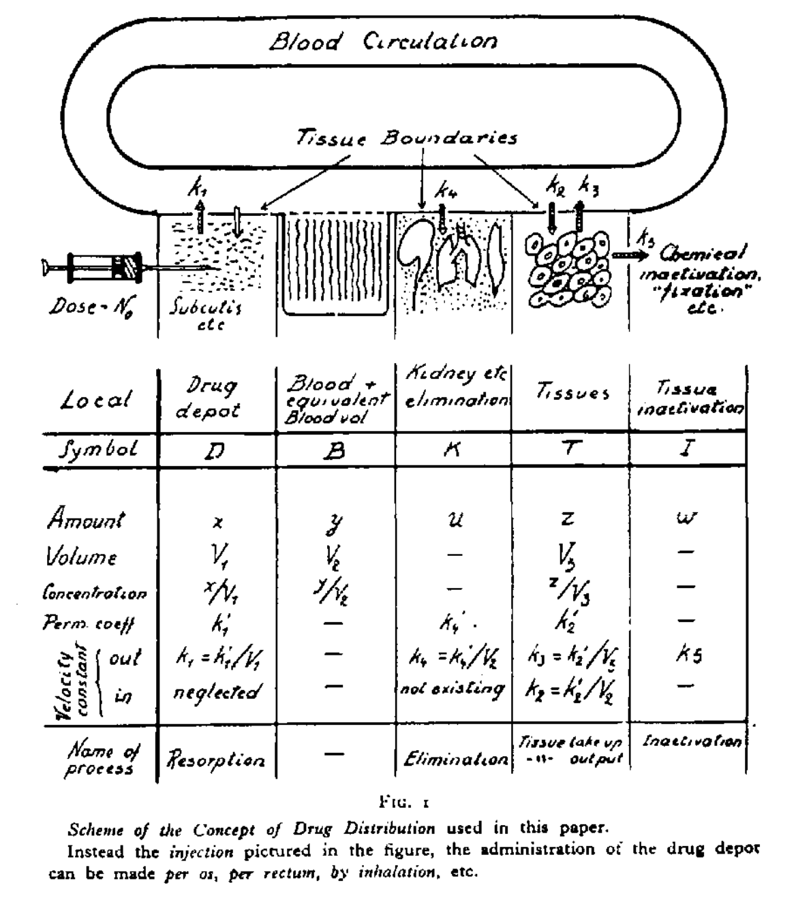

## Difference between popPK and PBPK modeling

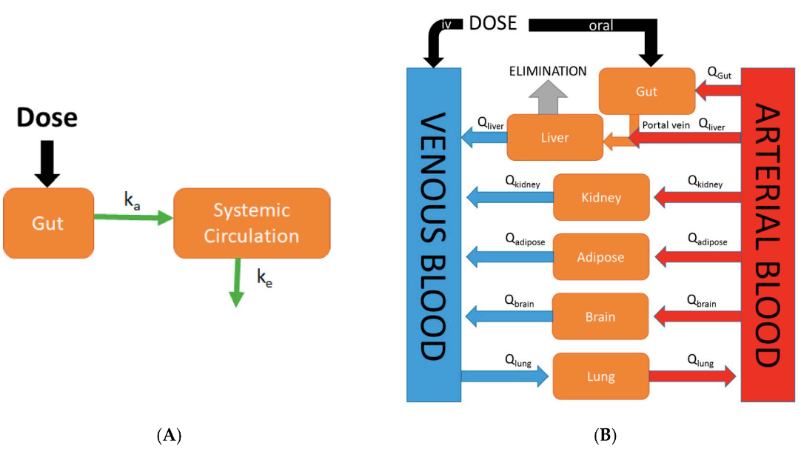
<font size="1"> https://www.mdpi.com/1999-4923/9/4/41/htm </font>

- Advantages of PBPK:
    - Bottom-up approach that can be used in case of little to no clinical data
        - special populations
        - environmental toxicology
    - Provides a mechanistic explanation of patient variability
    - Inter- and intra-species scalability
    - Well suited for DDI modeling
    - Provides drug concentrations in organs not accurately represented by plasma concentration (eye, skin, etc..) 
    
- Disadvantages of PBPK:
    - Complex
    - Computationally intensive
    
## PBPK model types

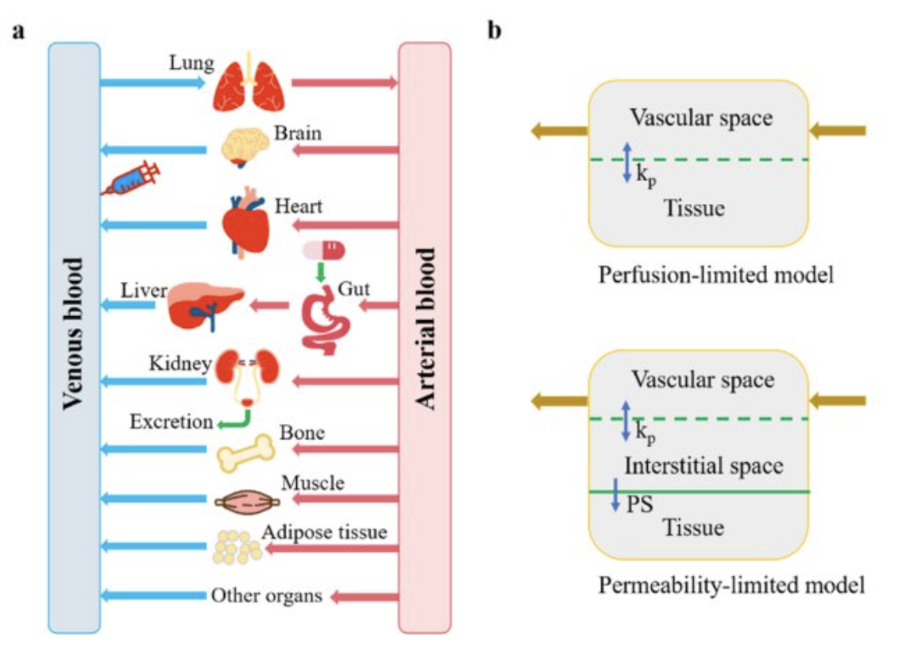
<font size="1"> https://www.mdpi.com/2218-1989/11/2/75 </font>

---

# General PBPK Workflow

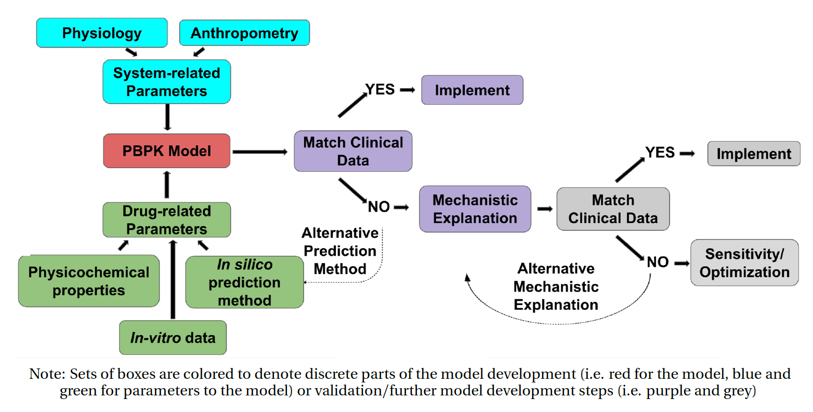{width=75%}

---

# Let's Start Coding..


## 1. Simple PBPK Model

```{r}

# load libraries
library(tidyverse)
library(mrgsolve)

```

### a. Model structure

{width=50%}

### b. Equations

* Non-eliminating compartment (Muscle)

$$\frac{dA_{mu}}{dt}=Q_{mu}(C_{art}-\frac{C_{mu}}{\frac{Kp_{mu}}{BP}})$$ 

* Eliminating compartment (Liver):

$$\frac{dA_{li}}{dt}=Q_{li}(C_{art}-\frac{C_{li}}{\frac{Kp_{li}}{BP}})-Cl_{li}.f_{u}.\frac{C_{li}}{\frac{Kp_{li}}{BP}}$$

* Arterial blood compartment:

$$\frac{dA_{art}}{dt}=Q_{lu}(\frac{C_{lu}}{\frac{Kp_{lu}}{BP}}-C_{art})$$
    
* Venous blood compartment:

$$\frac{dA_{ven}}{dt}=\sum_{T\neq lu} (Q_T.\frac{C_T}{\frac{Kp_T}{BP}}) − Q_{lu}.C_{ven}$$
    
* Lungs:

$$\frac{dA_{lu}}{dt}=Q_{lu}(C_{ven} − \frac{C_{lu}}{\frac{Kp_{lu}}{BP}})$$

### c. Tasks

1. Use `models/simplePBPK.mod` file to build a simple PBPK model.

2. Use `script.R` script to compile the model and run a simple simulation (chunks 1 and 2).

---

## 2. Voriconazole PBPK Model 

### a. References
Zane NR, Thakker DR. A physiologically based pharmacokinetic model for voriconazole disposition predicts intestinal first-pass metabolism in children. Clin Pharmacokinet. 2014;53: 1171–1182 <br> https://link.springer.com/article/10.1007%2Fs40262-014-0181-y

ICRP Publication 89 http://www.icrp.org/publication.asp?id=ICRP%20Publication%2089

Utsey, Kiersten, Madeleine S. Gastonguay, Sean Russell, Reed Freling, Matthew M. Riggs, and Ahmed Elmokadem. 2020. “Quantification of the Impact of Partition Coefficient Prediction Methods on PBPK Model Output Using a Standardized Tissue Composition.” Drug Metabolism and Disposition: The Biological Fate of Chemicals, July. https://doi.org/10.1124/dmd.120.090498.

### b. Model structure

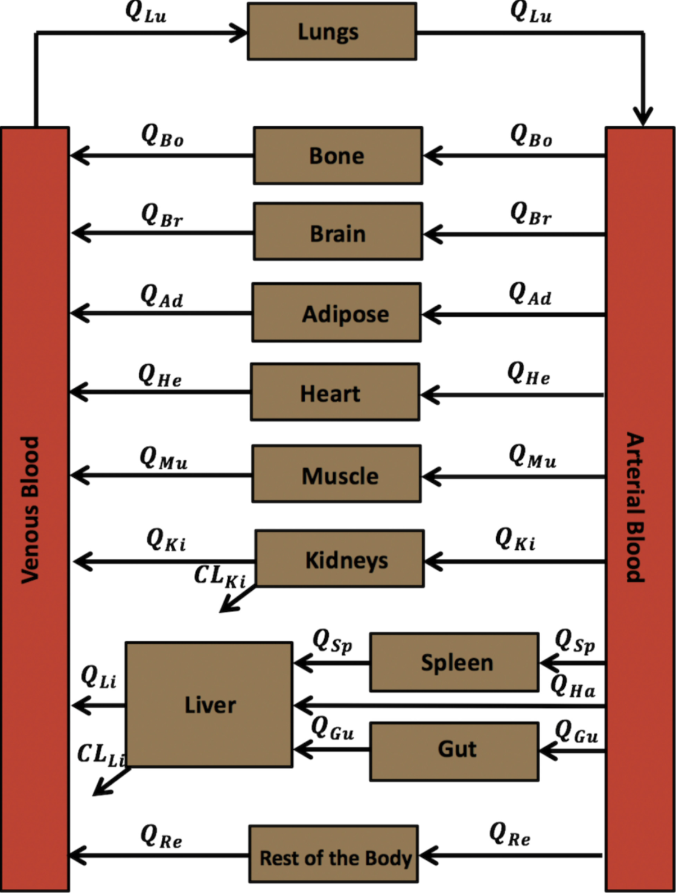{width=50%}

### c. Tasks

**Note:** for the following tasks use `script.R`

1. Explore and compile typical adult male PBPK model `models/voriPBPK.mod` 

```{r}

modA <- mread("models/voriPBPK.mod")

```

2. Use `calcKp_PT.R` function to calculate voriconzole tissue:plasma partition coefficients according to Poulin and Theil method https://www.ncbi.nlm.nih.gov/pubmed/11782904.

```{r}

source("calcKp_PT.R")

#voriconazole physicochemical properties
logP <- 2.56  #lipophilicity
pKa <- 1.76  
fup <- 0.42   #unbound fraction in plasma
type <- 3     #monoprotic base
BP <- 1       #blood:plasma concentration ratio
dat <- read.csv("data/tissue_comp_PT.csv")

#calculate partition coefficients
Kp <- calcKp_PT(logP=logP, pKa=pKa, fup=fup, BP=BP, type=type, dat=dat)

#update model parameters partition coefficients
modA <- param(modA, Kp)

```

3. Simulate the steady state after a 4 mg/kg IV infusion dose of voriconazole given to an 
adult male with a rate of 4 mg/kg/h twice a day for 7 days. Compare the steady state plasma drug concentration-time profiles from previous simulation to the observed data in 
`Adult_IV.csv`.
(N.B.: observed data were digitized from Zane and Thakker (2014) paper using WebPlotDigitizer https://automeris.io/WebPlotDigitizer/):

```{r}

#load observed IV infusion data
obs <- read.csv("data/Adult_IV.csv")

#set simulation conditions
bw   <- 73
amt  <- 4*bw
rate <- 4*bw
cmt  <- "VEN"
ii   <- 12
addl <- 13
ss   <- 1

#run simulation
sim <- 
  modA %>% 
  ev(amt=amt, cmt=cmt, ii=ii, addl=addl, rate=rate, ss=ss) %>% 
  mrgsim(delta = 0.1, end = 12) %>% 
  filter(row_number() != 1)  

#plot prediction and compare to observed data
gp <- ggplot() + 
  geom_point(data = obs, aes(x=time, y=obs, col="observed"), size=2.5) + 
  geom_errorbar(data = obs, aes(x = time, y = obs, ymin=obs-sd, ymax=obs+sd), width=0) +
  geom_line(data = sim, aes(x=time, y=CP, col="sim"), lwd=1) + 
  scale_colour_manual(name='', 
                      values=c('sim'='black', 'observed'='black'), 
                      breaks=c("observed","sim"),
                      labels=c("observed","predicted")) +
  guides(colour = guide_legend(override.aes = list(linetype=c(0,1), shape=c(16, NA)))) +
  labs(title="Adult 4 mg/kg IV", x="time (h)", y="Plasma concentration (mg/L)") +
  theme_bw()
gp

```

4. Simulate the steady state after a 200 mg PO dose of voriconazole given to an adult male 
with a rate of twice a day for 7 days. Compare the steady state plasma drug 
concentration-time profile to the observed data in `Adult_PO.csv`.

```{r}

obs <- read.csv("data/Adult_PO.csv")

bw   <- 73
amt  <- 200
cmt  <- "GUTLUMEN"
ii   <- 12
addl <- 13
ss   <- 1

sim <- 
  modA %>% 
  ev(amt=amt, cmt=cmt, ii=ii, addl=addl, ss=ss) %>% 
  mrgsim(delta = 0.1, end = 12) %>% 
  filter(row_number() != 1)  

gp <- ggplot() + 
  geom_point(data = obs, aes(x=time, y=obs, col="observed"), size=2.5) + 
  geom_errorbar(data = obs, aes(x = time, y = obs, ymin=obs-sd, ymax=obs+sd), width=0) +
  geom_line(data = sim, aes(x=time, y=CP, col="sim"), lwd=1) + 
  scale_colour_manual(name='', 
                      values=c('sim'='black', 'observed'='black'), 
                      breaks=c("observed","sim"),
                      labels=c("observed","predicted")) +
  guides(colour = guide_legend(override.aes = list(linetype=c(0,1), shape=c(16, NA)))) +
  labs(title="Adult 4 mg/kg PO", x="time (h)", y="Plasma concentration (mg/L)") +
  theme_bw()
gp

```

5. Integrate the model with an additional gut wall enterocyte compartment to account for 
intestinal clearance, intestinal transit and lumen solubility effects on absorption rate. 
Note: use about an intestinal clearance that is 30 times lower than hepatic clearance.
Recompile and re-run the previous step. Any change!!

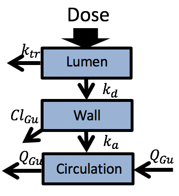{width=25%}
```{r}

modA <- mread("models/voriPBPK_ext.mod") %>%
  param(MPPGI = 30.3/30) %>%
  param(Kp)

sim <- 
  modA %>% 
  ev(amt=amt, cmt=cmt, ii=ii, addl=addl, ss=ss) %>% 
  mrgsim(delta = 0.1, end = 12) %>% 
  filter(row_number() != 1)  

gp <- ggplot() + 
  geom_point(data = obs, aes(x=time, y=obs, col="observed"), size=2.5) + 
  geom_errorbar(data = obs, aes(x = time, y = obs, ymin=obs-sd, ymax=obs+sd), width=0) +
  geom_line(data = sim, aes(x=time, y=CP, col="sim"), lwd=1) + 
  scale_colour_manual(name='', 
                      values=c('sim'='black', 'observed'='black'), 
                      breaks=c("observed","sim"),
                      labels=c("observed","predicted")) +
  guides(colour = guide_legend(override.aes = list(linetype=c(0,1), shape=c(16, NA)))) +
  labs(title="Adult 4 mg/kg PO", x="time (h)", y="Plasma concentration (mg/L)") +
  theme_bw()
gp


```

6. Generate pediatric model

```{r}
# pediatric (5 yo) male physiology; https://www.ncbi.nlm.nih.gov/pubmed/14506981
pedPhys <- list(WEIGHT = 19,
                Vad = 5.5,
                Vbo = 2.43,
                Vbr = 1.31,
                VguWall = 0.22,
                VguLumen = 0.117,
                Vhe = 0.085,
                Vki = 0.11,
                Vli = 0.467,
                Vlu = 0.125,
                Vmu = 5.6,
                Vsp = 0.05,
                Vbl = 1.5,
                Qad = 0.05*3.4*60,
                Qbo = 0.05*3.4*60,
                Qbr = 0.12*3.4*60,
                Qgu = 0.15*3.4*60, 
                Qhe = 0.04*3.4*60,
                Qki = 0.19*3.4*60,
                Qmu = 0.17*3.4*60,
                Qsp = 0.03*3.4*60,
                Qha = 0.065*3.4*60, 
                Qlu = 3.4*60,
                MPPGL = 26,
                VmaxH = 120.5,
                KmH = 11,
                MPPGI = 0,
                VmaxG = 120.5,
                KmG = 11)

modP <- param(modA, pedPhys)

```

7. Simulate the steady state after a 4 mg/kg voriconazole IV infusion dosing in a male child 
subject infused at a rate of 3 mg/kg/h twice a day for seven days. Compare the steady state 
to the observed data in `Pediatric_IV.csv`.

```{r}

obs <- read.csv("data/Pediatric_IV.csv")  #load observed data

wt   <- 19  #pediatric body weight
amt  <- 4*wt  
rate <- 3*wt
cmt  <- "VEN"  #intravenous infusion
ii   <- 12
addl <- 13
ss   <- 1

# simulate
sim <- 
  modP %>%
  ev(amt=amt, cmt=cmt, ii=ii, addl=addl, rate=rate, ss=1) %>% 
  mrgsim(delta = 0.1, end = 12) %>% 
  dplyr::filter(row_number() != 1)  

# plot
gp <- ggplot() + 
  geom_point(data = obs, aes(x=time, y=obs, col="observed"), size=2.5) + 
  geom_errorbar(data = obs, aes(x = time, y = obs, ymin=obs-sd, ymax=obs+sd), width=0) +
  geom_line(data = sim, aes(x=time, y=CP, col="sim"), lwd=1) + 
  scale_colour_manual(name='', 
                      values=c('sim'='black', 'observed'='black'), 
                      breaks=c("observed","sim"),
                      labels=c("observed","predicted")) +
  guides(colour = guide_legend(override.aes = list(linetype=c(0,1), shape=c(16, NA)))) +
  labs(title="Pediatric 4 mg/kg IV", x="time (h)", y="Plasma concentration (mg/L)") +
  theme_bw()
gp

```

8. Simulate the steady state after a 4 mg/kg voriconazole PO dosing in a male child subject 
twice a day for seven days. Compare to obsreved data in `Pediatric_PO.csv`
Note: Include a similar 30-fold lower intestinal clearance than hepatic clearance.

```{r}

obs <- read.csv("data/Pediatric_PO.csv")  #load observed data

# adjust intestinal clearance
modP <- modP %>% param(MPPGI = 26 / 30)

# simulation conditions
bw   <- 19
amt  <- 4 * bw
cmt  <- "GUTLUMEN"
ii   <- 12
addl <- 13
ss   <- 1

# simulate
sim <- 
  modP %>%
  ev(amt=amt, cmt=cmt, ii=ii, addl=addl, ss=1) %>% 
  mrgsim(delta = 0.1, end = 12) %>% 
  dplyr::filter(row_number() != 1)  

# plot
gp <- ggplot() + 
  geom_point(data = obs, aes(x=time, y=obs, col="observed"), size=2.5) + 
  geom_errorbar(data = obs, aes(x = time, y = obs, ymin=obs-sd, ymax=obs+sd), width=0) +
  geom_line(data = sim, aes(x=time, y=CP, col="sim"), lwd=1) + 
  scale_colour_manual(name='', 
                      values=c('sim'='black', 'observed'='black'), 
                      breaks=c("observed","sim"),
                      labels=c("observed","predicted")) +
  guides(colour = guide_legend(override.aes = list(linetype=c(0,1), shape=c(16, NA)))) +
  labs(title="Pediatric 4 mg/kg PO", x="time (h)", y="Plasma concentration (mg/L)") +
  theme_bw()
gp

```

---

### d. Sensitivity Analysis

#### i. Local

##### Graphical

Run graphical sensitivity analysis for the muscle:plasma (`Kpmu`) and 
lung:plasma (`Kplu`) partition coefficients using adult IV data.

```{r}

#set simulation conditions
bw   <- 73
amt  <- 4*bw
rate <- 4*bw
cmt  <- "VEN"
ii   <- 12
addl <- 13
ss   <- 1

##' Define an intervention
e <- ev(cmt=cmt, amt=amt, rate=rate, ii= ii, addl=addl, ss=1)

## Sensitivity analysis on Kpmu
idata <- expand.idata(Kpmu = c(3/2, 3, 3*2))

modA %>%
  carry_out(Kpmu) %>% 
  mrgsim_ei(e, idata, delta = 0.1, recsort=3, obsonly=TRUE, end = 12) %>% 
  mutate(Kpmu = factor(Kpmu)) %>%
  ggplot(aes(x=time, y=CP, col=Kpmu)) +
  geom_line() +
  labs(x="time (h)", y="Plasma concentration (mg/L)") +
  theme_bw()

##' Sensitivity analysis on Kplu
idata <- expand.idata(Kplu = c(1/2, 1, 1*2))

modA %>%
  carry_out(Kplu) %>% 
  mrgsim_ei(e, idata, delta = 0.1, recsort=3, obsonly=TRUE, end = 12) %>% 
  mutate(Kplu = factor(Kplu)) %>%
  ggplot(aes(x=time, y=CP, col=Kplu)) +
  geom_line() +
  labs(x="time (h)", y="Plasma concentration (mg/L)") +
  theme_bw()

```

##### `mrgsim.sa` package

The package mrgsim.sa simplifies the process of running local sensitivity analysis https://github.com/kylebaron/mrgsim.sa. The package can do graphical sensitivity as well as obtaining local sensitivity coefficients.

$$\frac{\partial{y_i}}{\partial{\theta_j}}.\frac{w_{\theta{j}}}{w_{y_i}}$$

What is the most influential parameter?

```{r}

library(mrgsim.sa)

### sensitivity analysis

#set the output variable of interest
sensvar <- c("CP")  

# graphical sensitivity for each parameter
out_sens <- 
  modA %>% 
  ev(amt=amt, cmt=cmt, ii=ii, addl=addl, rate=rate, ss=ss) %>% 
  select_par(all_of(names(Kp[-11]))) %>% 
  parseq_fct(.n=3) %>% 
  sens_each(delta = 0.1, recsort=3, obsonly=TRUE, end = 12)

sens_plot(out_sens, "CP", grid = TRUE) 

# graphical sensitivity for a grid of parameters
out_sens_grid <- 
  modA %>% 
  ev(amt=amt, cmt=cmt, ii=ii, addl=addl, rate=rate, ss=ss) %>% 
  parseq_cv(Kpmu, Kplu, .n=3) %>% 
  sens_grid(delta = 0.1, recsort=3, obsonly=TRUE, end = 12)

sens_plot(out_sens_grid, "CP")
  
# local sensitivity analysis 
out_lsa <- lsa(modA, var = "CP", par = names(all_of(Kp[-11])), events = ev(amt=amt, cmt=cmt, ii=ii, addl=addl, rate=rate, ss=ss), end=12, delta=0.1, eps=1e-4)

lsa_plot(out_lsa, pal = NULL)

# get a summary of sensitivity coefficients
out_lsa_summ <- out_lsa %>% 
  group_by(p_name) %>%
  summarise(mean_sens = mean(sens)) %>%
  ungroup()

ggplot(data=out_lsa_summ, aes(x=reorder(p_name, mean_sens), y=mean_sens)) + 
    geom_col() + 
    labs(x="Parameter", y="Coefficient") +
    coord_flip() +
    geom_hline(yintercept = 0, lty=2) +
    theme_bw()

```

#### ii. Global

Review sobol global sensitivity analysis from `sensitivity` package (https://cran.r-project.org/web/packages/sensitivity/index.html) <br> 
Zhang, X-Y, M. N. Trame, L. J. Lesko, and S. Schmidt. 2015. “Sobol Sensitivity Analysis: A Tool to Guide the Development and Evaluation of Systems Pharmacology Models.” CPT: Pharmacometrics & Systems Pharmacology 4 (2): 69–79. https://ascpt.onlinelibrary.wiley.com/doi/full/10.1002/psp4.6 <br>
Vignette: https://github.com/mrgsolve/gallery/blob/master/application/sobol.md

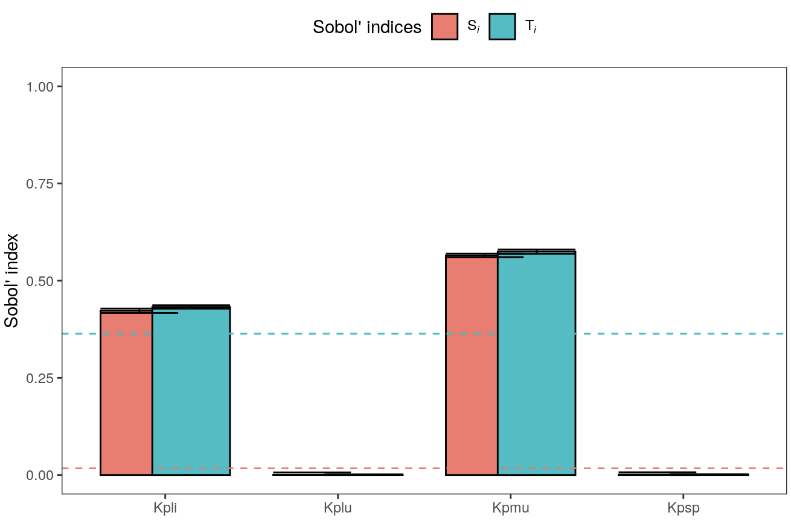{weight=50%}

---

### e. Parameter Estimation

- Use package `nloptr` (https://cran.r-project.org/web/packages/nloptr/index.html) to optimize for most influential partition coefficient parameter and compare prediction before and after optimization to observed data <br>
- Use package `numDeriv` (https://cran.r-project.org/web/packages/numDeriv/index.html) to generate the 95% CI around the parameter estimates <br>
- For more background on optimization methods, check out Metrum's open science course MI210 https://metrumrg.com/course/mi210-essentials-population-pk-pd-modeling-simulation/

```{r}

library(nloptr)
library(numDeriv)
library(kableExtra)

### Do some data assembly to create dataset for optimization

#load observed IV infusion data
bw <- 73
obs <- read.csv("data/Adult_IV.csv")

# create an nm-tran dataset
nm_dv <- obs %>%
  select(time, dv=obs) %>%
  mutate(ID = 1,
         amt = 0,
         rate = 0,
         cmt = "VEN",
         evid = 0,
         ii = 0,
         addl = 0,
         ss = 0)

nm_dose <- nm_dv %>%
  slice(1) %>%
  mutate(amt = 4*bw,
         rate = 4*bw,
         ii = 12,
         addl = 13,
         ss = 1,
         dv = NA,
         evid = 1)

nm <- bind_rows(nm_dose, nm_dv) %>% arrange(time)

##set up objective function
OF <- function(pars, dat, pred=F){
  pars <- lapply(pars,exp)  #Get out of log domain for MLE
  pars <- as.list(pars)
  names(pars) <- names(theta)
  
  ## Get a prediction
  out <- modA %>% param(pars) %>% mrgsim_d(dat, carry_out=c("dv"), output="df")
  
  if(pred) return(out)
  
  ##OLS
  #return(sum((out$CP - out$dv)^2))
  
  ##maximum likelihood
  return(-1*sum(dnorm(log(out$dv),
                      mean=log(out$CP),
                      sd=pars$sigma, log=TRUE), na.rm = T))
}

# set initial values
theta <- log(c(Kpmu=2.94, sigma=1))  #initial parameter for MLE; mean and standard deviation

##Fit with nloptr package
##derivative-free optimizers
#fit <- neldermead(theta, OF)  #Nelder-Mead simplex
fit <- newuoa(theta, OF, dat=nm)  #New Unconstrained Optimization with quadratic Approximation

##gradient-basd optimizers
#fit <- tnewton(theta, OF)  #Local optimizer; Nelder-Mead simplex
#fit <- mlsl(theta, OF, lower=log(c(0.1)), upper=log(c(10)))  #global optimizer; multi-level single-linkage; takes very long ~ 10 min

##global optimizers
#fit <- direct(OF, lower=log(c(0.1, 0.1)), upper=log(c(10, 2)))  #DIviding RECTangles algorithm; takes ~ 3 min

fit

p <- as.list(exp(fit$par))  #get the parameters on the linear scale
names(p) <- names(theta)
p

# get standard error and confidence intervals around the estimated parameters
h <- hessian(OF, fit$par, dat=nm)
vc_log <- solve(h)  #variance-covariance matrix
SE_log <- sqrt(diag(vc_log))  #standard error on log scale

# create dataframe with parameter summary
sig <- function(x) signif(x, 3)
paramSumm <- tibble(Parameter = names(theta),
                    Estimate = exp(fit$par),
                    lb = exp(fit$par - (1.96 * SE_log)),
                    ub = exp(fit$par + (1.96 * SE_log))) %>%
  mutate(`Estimate (95% CI)` = paste0(sig(Estimate), " (", sig(lb), ", ", sig(ub), ")")) %>%
  select(Parameter, `Estimate (95% CI)`)

paramSumm %>%
  knitr::kable() %>%
  kable_styling()

# compare initial predictions to those using the optimized parameters
predB4 <- OF(theta, dat=nm, pred=T)
predAfter <- OF(fit$par, dat=nm, pred=T)

gp <- ggplot() +
  geom_point(data=obs, aes(x=time, y=obs)) + 
  geom_errorbar(data=obs, aes(x=time, y=obs, ymin=obs-sd, ymax=obs+sd), width=0) +
  geom_line(data=predB4, aes(x=time, y=CP), lty=2) +
  geom_line(data=predAfter, aes(x=time, y=CP)) +
  labs(x="time (h)", y="Plasma concentration (mg/L)") + 
  theme_bw()
gp

```

check out:

- vignette for MAP Bayes parameter estimation: https://mrgsolve.github.io/blog/map_bayes.html 
- `nlmixr` package for nonlinear mixed effects modeling https://github.com/nlmixrdevelopment/nlmixr

Simulate a 4 mg/kg voriconazole IV infusion dosing in a male child subject infused at a rate of 3 mg/kg/h twice a day for seven days. Compare the steady state prediction before and after optimization to the observed data in `Pediatric_IV.csv`.

```{r}

obs <- read.csv("data/Pediatric_IV.csv")  #load observed data

wt <- 19  #adult body weight
amt <- 4*wt  
rate <- 3*wt
cmt <- "VEN"  #intravenous infusion
ii = 12
addl = 13
ss = 1

# simulate
simB4 <- as.data.frame(modP %>%
                         ev(amt=amt, cmt=cmt, ii=ii, addl=addl, rate=rate, ss=1) %>% 
                         mrgsim(delta = 0.1, end = 12)) %>% 
  dplyr::filter(row_number() != 1)  

simAfter <- as.data.frame(modP %>%
                            param(Kpmu=p$Kpmu) %>%
                            ev(amt=amt, cmt=cmt, ii=ii, addl=addl, rate=rate, ss=1) %>% 
                            mrgsim(delta = 0.1, end = 12)) %>% 
  dplyr::filter(row_number() != 1)

# plot
gp <- ggplot() + 
  geom_point(data = obs, aes(x=time, y=obs), size=2.5) + 
  geom_errorbar(data = obs, aes(x = time, y = obs, ymin=obs-sd, ymax=obs+sd), width=0) +
  geom_line(data = simB4, aes(x=time, y=CP), lty=2) + 
  geom_line(data = simAfter, aes(x=time, y=CP)) + 
  labs(title="Pediatric 4 mg/kg IV", x="time (h)", y="Plasma concentration (mg/L)") +
  theme_bw()
gp

```

---

### f. Population simulations

#### i. How to create a population?

Need to introduce interindividual variability to *physiological* parameters

Willmann, Stefan, Karsten Höhn, Andrea Edginton, Michael Sevestre, Juri Solodenko, Wolfgang Weiss, Jörg Lippert, and Walter Schmitt. 2007. “Development of a Physiology-Based Whole-Body Population Model for Assessing the Influence of Individual Variability on the Pharmacokinetics of Drugs.” Journal of Pharmacokinetics and Pharmacodynamics 34 (3): 401–31. https://pubmed.ncbi.nlm.nih.gov/17431751/

Huisinga, W., A. Solms, L. Fronton, and S. Pilari. 2012. “Modeling Interindividual Variability in Physiologically Based Pharmacokinetics and Its Link to Mechanistic Covariate Modeling.” CPT: Pharmacometrics & Systems Pharmacology 1 (September): e4. https://ascpt.onlinelibrary.wiley.com/doi/10.1038/psp.2012.3

“NHANES - National Health and Nutrition Examination Survey Homepage.” 2018. July 26, 2018. http://www.cdc.gov/nchs/nhanes/.

Meyer, Michaela, Sebastian Schneckener, Bernd Ludewig, Lars Kuepfer, and Joerg Lippert. 2012. “Using Expression Data for Quantification of Active Processes in Physiologically Based Pharmacokinetic Modeling.” Drug Metabolism and Disposition: The Biological Fate of Chemicals 40 (5): 892–901. https://pubmed.ncbi.nlm.nih.gov/22293118/


#### ii. Simulation

1. Simulate a simple voriconazole dosing scenario for a population of 100 individuals, 50 females and 50 males, with ages ranging between 20-80, weights ranging between 50-100 kg and heights between 1.5 and 1.9 m. Use population saved in file `../data/derived/popPars_100.rds`

```{r}

# load population params
popPars <- readRDS("data/popPars_100.rds")

# add IIV on CL/VmaxH
set.seed(192898)
iVmaxH <- rlnorm(100, meanlog=log(40), sdlog=0.2)

# add to popPars
popPars2 <- lapply(1:length(popPars), function(i){
  pars <- c(popPars[[i]],list(VmaxH = iVmaxH[i]))
  return(pars)
  })

# simulate
modA2 <- mread("models/voriPBPK2.mod")
Kpmu <- 0.56
modA2 <- param(modA2, Kpmu=Kpmu)

#set simulation conditions
bw   <- 73
amt  <- 4*bw
rate <- 4*bw
cmt  <- "VEN"
ii   <- 12
addl <- 13
ss   <- 1
delta <- 0.1
end <- 12

# prepare simulation dataset
idata <- popPars2 %>% bind_rows()

e <- ev(amt=amt, cmt=cmt, ii=ii, addl=addl, rate=rate, ss=ss)

data <- e %>% 
  as_tibble %>% 
  bind_cols(idata) %>%
  mutate(amt = 4*BW, rate = 4*BW) %>%
  select(ID, everything())

#run simulation
system.time(sims <- modA2 %>% 
              mrgsim_d(data=data, delta = delta, end = end, obsonly=T, outvars = c("CP"), output="df"))

# get summary stats for population prediction
hi95 <- function(x) quantile(x, probs = c(0.95))
lo05 <- function(x) quantile(x, probs = c(0.05))

sims2 <- sims %>%
  group_by(time) %>%
  mutate(loCP = lo05(CP),
         medCP = median(CP),
         hiCP = hi95(CP)) %>%
  ungroup() %>%
  filter(ID == first(ID))

#plot population predictions 
gp <- ggplot(data = sims2 %>% filter(row_number() != 1), aes(x=time)) + 
  geom_line(aes(y=medCP), col="black") +
  geom_ribbon(aes(ymin=loCP, ymax=hiCP), alpha = 0.5) +
  scale_y_continuous(trans = "log10") +
  labs(title="Population simulation", x="time (h)", y="Plasma concentration (mg/L)") +
  theme_bw()
gp

```

2. Use `PKNCA` package to calculate summary statistics for the population

```{r}

library(PKNCA)

# create dose object
dose_obj <-
  PKNCAdose(
    data,
    amt~time|ID
  )

# create conc object
conc_obj <-
  PKNCAconc(
    sims,
    CP~time|ID
  )

# combine
data_obj <- PKNCAdata(conc_obj, dose_obj)

## Calculate the NCA parameters
results_obj <- pk.nca(data_obj)

## Summarize the results
summary(results_obj)

```


#### Case study

Compare doses 3 and 4 mg/kg for adults. Which dose keeps minimum voriconazole concentration at steady state above MIC (1 mg/L) for >= 90% of subjects?

```{r}

library(cowplot)

data_3mg <- e %>% 
  as_tibble %>% 
  bind_cols(idata) %>%
  mutate(amt = 3*BW, rate = 3*BW) %>%
  select(ID, everything())

#run simulation
sims_3mg <- modA2 %>% 
  mrgsim_d(data=data_3mg, delta = delta, end = end, obsonly=T, outvars = c("CP")) %>% 
  filter(row_number() != 1)

sims2_3mg <- sims_3mg %>%
  group_by(time) %>%
  mutate(loCP = lo05(CP),
         medCP = median(CP),
         hiCP = hi95(CP)) %>%
  ungroup() %>%
  filter(ID == first(ID))

#plot population predictions 
gp_3mg <- ggplot(data = sims2_3mg, aes(x=time)) + 
  geom_line(aes(y=medCP), col="black") +
  geom_ribbon(aes(ymin=loCP, ymax=hiCP), alpha = 0.5) +
  scale_y_continuous(trans = "log10", limits=c(0.3,7)) +
  labs(title="Population simulation (3 mg/kg)", x="time (h)", y="Plasma concentration (mg/L)") +
  theme_bw() + 
  geom_hline(aes(yintercept = 1), lty=2) 

gp_4mg <- gp + 
  labs(title="Population simulation (4 mg/kg)", x="time (h)", y="Plasma concentration (mg/L)") +
  geom_hline(aes(yintercept = 1), lty=2) +
  scale_y_continuous(trans = "log10", limits=c(0.3,7))

gp_34 <- plot_grid(gp_3mg, gp_4mg, ncol=2) 
gp_34

# calculate stats
stats_4mg <- sims %>%
  filter(time != 0) %>%
  group_by(ID) %>%
  mutate(Cmin = min(CP)) %>%
  slice(1) %>%
  ungroup() %>%
  mutate(FLG = ifelse(Cmin < 1, 1, 0))
percHi_4mg <- (nrow(stats_4mg[stats_4mg$FLG==0,]) / nrow(stats_4mg)) * 100

stats_3mg <- sims_3mg %>%
  filter(time != 0) %>%
  group_by(ID) %>%
  mutate(Cmin = min(CP)) %>%
  slice(1) %>%
  ungroup() %>%
  mutate(FLG = ifelse(Cmin < 1, 1, 0))
percHi_3mg <- (nrow(stats_3mg[stats_3mg$FLG==0,]) / nrow(stats_3mg)) * 100 

stats_df <- tibble(Dose = c("3 mg/kg","4 mg/kg"),
                   `Percent of subjects with SS Cmin > MIC` = c(percHi_3mg, percHi_4mg))

stats_df %>%
  knitr::kable() %>%
  kable_styling()

```


#### iii. Parallelization

Use the package `mrgsim.apply` (vignette: https://github.com/kylebaron/mrgsim.parallel) to run the same population simulation over parallel cores. How long does it take compared to the single core simulation?

```{r}

library(future)
library(mrgsim.parallel)

# set parallelization options
nCores <- future::availableCores()
options(future.fork.enable=TRUE, mc.cores = nCores)
plan(multicore, workers = nCores)

#run simulation
system.time(sims <- modA2 %>% 
  future_mrgsim_d(data=data, nchunk = nCores, delta = delta, end = end, obsonly=T, outvars = c("CP")) %>% 
  filter(row_number() != 1))
 
# get summary stats for population
hi95 <- function(x) quantile(x, probs = c(0.95))
lo05 <- function(x) quantile(x, probs = c(0.05))

sims2 <- sims %>%
  group_by(time) %>%
  mutate(loCP = lo05(CP),
         medCP = median(CP),
         hiCP = hi95(CP)) %>%
  ungroup() %>%
  filter(ID == first(ID))

#plot population predictions 
gp <- ggplot(data = sims2, aes(x=time)) + 
  geom_line(aes(y=medCP), col="black") +
  geom_ribbon(aes(ymin=loCP, ymax=hiCP), alpha = 0.5) +
  scale_y_continuous(trans = "log10") +
  labs(title="Population simulation - parallel", x="time (h)", y="Plasma concentration (mg/L)") +
  theme_bw()
gp

```

---

### g. Shiny - Interactive Document

Explore the simple shiny app saved as `app.R`

---

## 3. Monoclonal Antibody Model

#### mAb structure

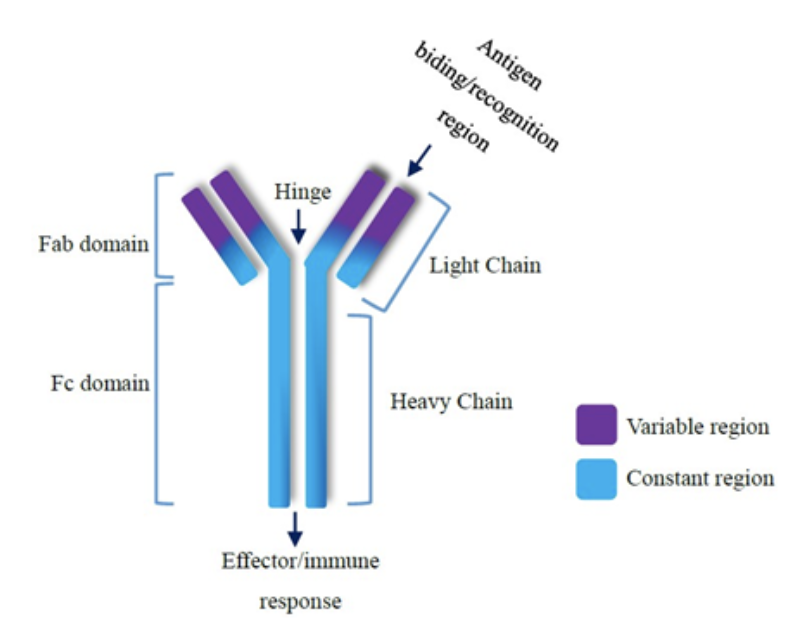
<font size="1"> https://medcraveonline.com/MOJI/advances-in-monoclonal-antibodies-production-and-cancer-therapy.html </font>

#### Main differences between small and large molecule (mAb) PBPK models

- mAb clearance is controlled by interaction with endosomal FcRn
- mAbs typically don't enter the intracellular space
- Lymphatic system is crucial for mAb drainage to circulation

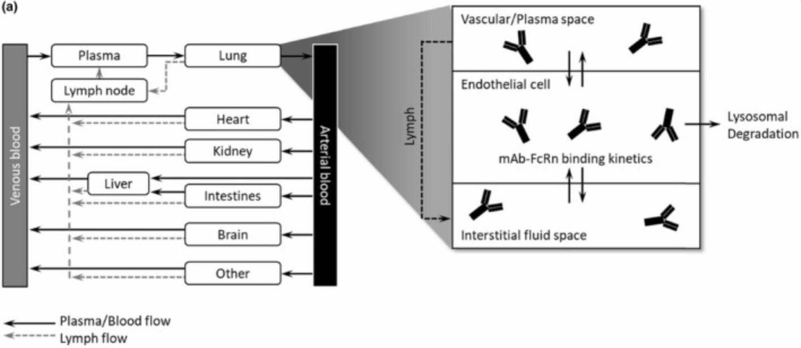
<font size="1"> https://pubmed.ncbi.nlm.nih.gov/34687040/ </font>

### Case study: Bamlanivimab

**The story:**

- In early 2020, Lilly approached Metrum to collaborate on developing a novel mAb treatment for COVID-19.
- The objectives were:
    - Select a mAb candidate from the candidate list
    - Select the dose for first-in-human (FIH) trials 
    
- **What we had**:
    - No *in vivo* data before the need to select the mAb candidate and its dose for FIH
    - Viral neutralization *in vitro* data might be available just prior to selection
    - This quote:
    
<font size="1"> https://www.insideindianabusiness.com/articles/skovronsky-lilly-aims-to-test-covid19-therapy-by-summer </font>


- **Method**: Build a mAb PBPK model and use available *in vitro* data for different candidates to address the objectives.

**OPEN SCIENCE**

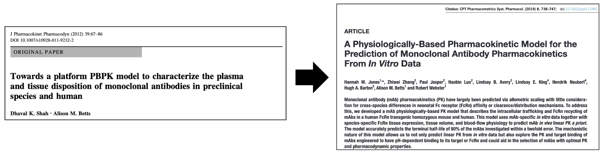

- **Results**:
    - Identified bamlanivimab (LY-CoV555) as the best mAb candidate that would achieve the target concentration (IC90) in the lung tissue over 28 days in 90% of patients using the lowest dose possible.
    - The PBPK model predictions suggested a clinical dose between 175-500 mg. The viral dynamics model suggested a clinical dose of 700 mg (achieves maximum viral elimination).

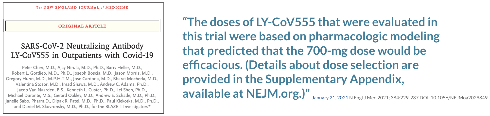

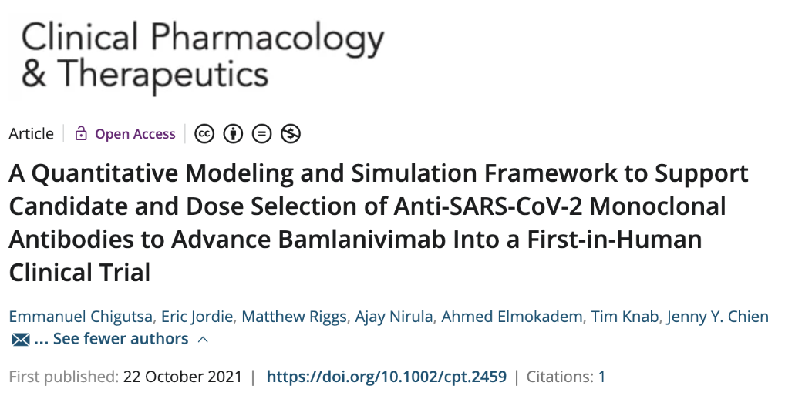

- Results validation after clinical data became available:

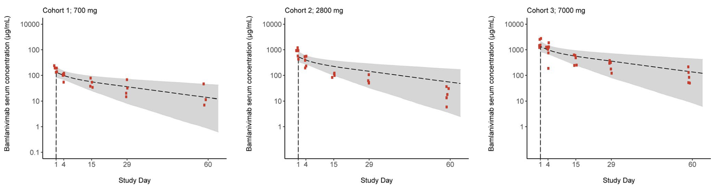

https://github.com/metrumresearchgroup/bioPBPK

```{r}

mod_mab <- mread("models/mAb_bamlanivimab.mod")

# set up simulation conditions
dose <- 700/150 #700 mg to umol
dur <- 2
rate <- dose/dur
cmt <- 4
end <- 28*24
e <- ev(amt=dose, rate=rate, cmt=cmt)

sim_mab <- mod_mab %>%
  mrgsim_e(e, end=end, outvars=c("Cexg_Plasma", "Cexg_Lung_IS")) %>%
  as_tibble() 

sim_mab2 <- sim_mab %>%
  mutate(time = time/24,
         Plasma = Cexg_Plasma*150,
         `Lung interstitial` = Cexg_Lung_IS*150) %>%
  select(-Cexg_Plasma, -Cexg_Lung_IS) %>%
  gather(tissue, conc, -ID, -time)

# plot
p_mab <- ggplot(data=sim_mab2, aes(x=time, y=conc, col=tissue)) +
  geom_line(lwd=1) +
  geom_hline(yintercept = 0.41481, lty=2) +
  scale_x_continuous(breaks=seq(0, 28, 7)) +
  scale_y_continuous(trans = "log10") +
  labs(x="Time (d)", y=expression("mAb concentration ("*mu*"g/mL)")) +
  theme_bw()
p_mab

```

